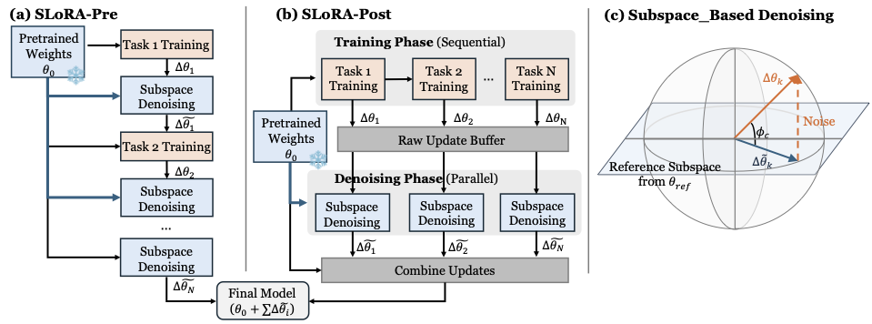

# SLoRA: Balancing Plasticity and Forgetting in Large Language Models for Continual Learning
This is the official implementation of the paper **"SLoRA: Balancing Plasticity and Forgetting in Large Language Models for Continual Learning"**.

*Figure 1: Overview of the SLoRA framework, illustrating the SLoRA-Pre and SLoRA-Post denoising pipelines.*

## 📝 Introduction

**SLoRA** is the first work to identify **noise accumulation** in LoRA updates as a primary cause of catastrophic forgetting in the continual learning (CL) of Large Language Models (LLMs). 

Unlike traditional regularization-based methods that often restrict a model's plasticity, SLoRA offers a **regularization-free** framework. It filters noisy components from LoRA updates via subspace similarity analysis with the frozen base model, effectively balancing stability and plasticity without accessing past data or modifying the training process.

## 🚀 Key Features

* **Regularization-free**: No constraints are added during the training phase, preserving the model's full capacity to learn new tasks.
* **Post-hoc Denoising**: Interference is mitigated after adaptation by selectively removing noisy components based on subspace similarity.
* **Dual Variants**: 
    * **SLoRA-Pre**: Optimized for **online** continual learning with incremental denoising after each task.
    * **SLoRA-Post**: Optimized for **offline** batch denoising after a full sequence of tasks.
* **Lightweight & Scalable**: Requires no rehearsal buffers or historical gradient storage, making it compatible with standard LoRA pipelines even for long task sequences.